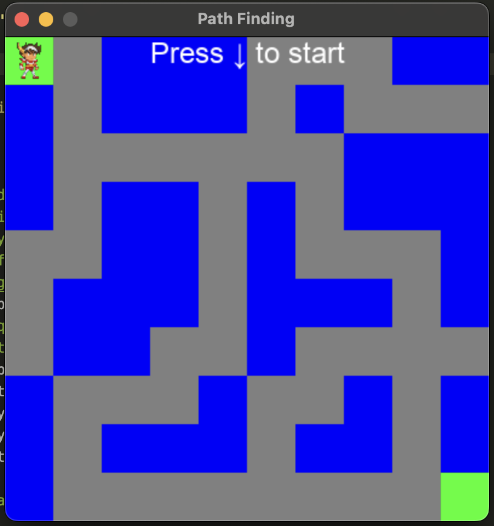
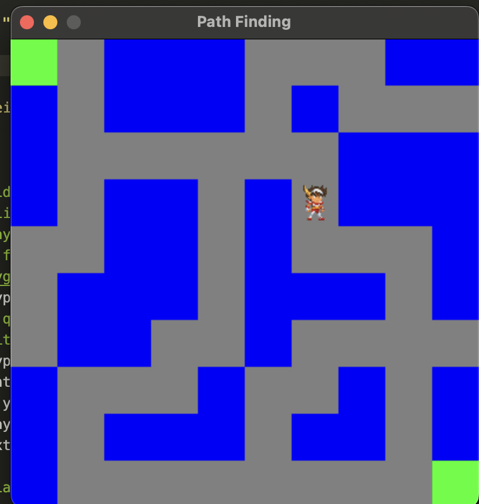
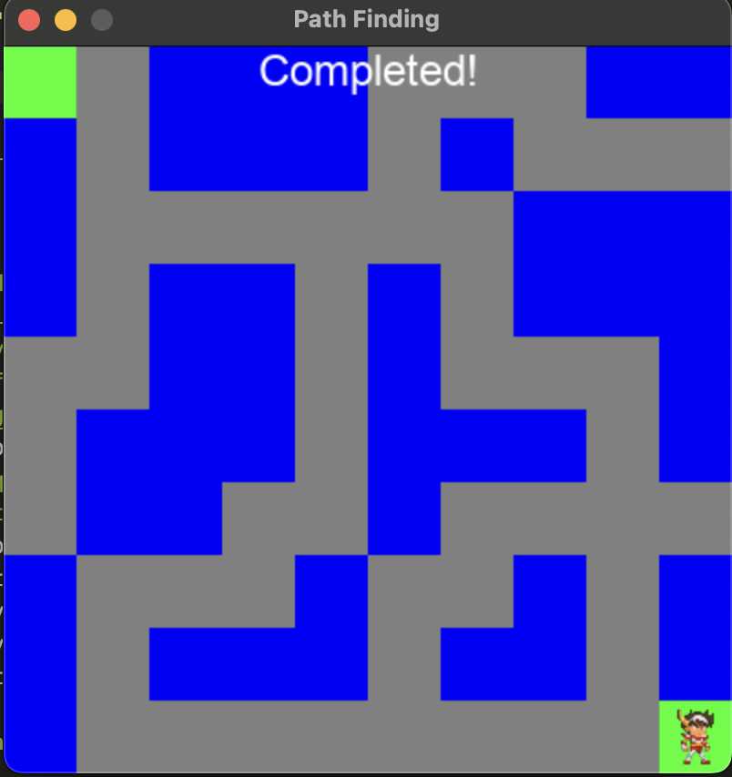

# 🧠 Breadth-First Search Pathfinding Game

A simple game built with **Pygame** to demonstrate the use of the **Breadth-First Search (BFS)** algorithm to find the shortest path in a grid-based maze.

## 🎮 Gameplay

- Navigate through a randomly generated map full of walls (`1`) and paths (`0`).
- Your character starts at `S` and needs to reach the goal `E`.
- Press the **Down Arrow** key to start the BFS algorithm and watch it find the shortest path.
- Visual feedback shows the step-by-step traversal from start to end.

## 📸 Screenshots





## 🧪 Features

- 🔍 Visual Breadth-First Search pathfinding
- 🎨 Pixel art character movement
- 🧱 Tile-based rendering using Pygame
- ⌨️ Keyboard control to trigger pathfinding

## 🚀 Getting Started

### Requirements

- Python 3.8+
- `pygame`
- `uv`

### Installation

```bash
uv sync
